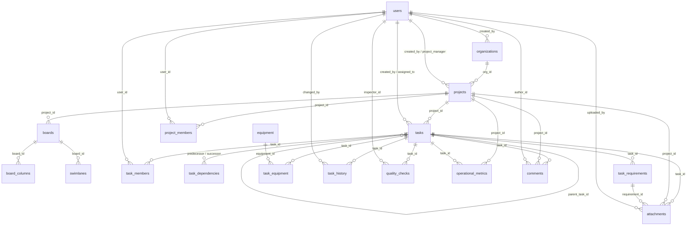

# Tasktrone — Business & Domain Model

> **A comprehensive blueprint of the industrial workflow platform bridging manufacturing execution and data intelligence.**

This document defines the **domain model**, **role framework**, **data architecture**, and **design principles** that underpin Tasktrone. It is written for architects, developers, and domain experts who need to understand *why* the system is shaped the way it is — not just *how* it works.

---

## Table of Contents

1. [Platform Overview](#platform-overview)  
2. [Core Domain Concepts](#core-domain-concepts)  
   - [Layers of the Organization](#layers-of-the-organization)  
   - [Workflow Phases: Abstract & Concrete](#workflow-phases-abstract--concrete)  
   - [Task Lifecycle & Dependencies](#task-lifecycle--dependencies)  
3. [Role-Based Access Control (RBAC)](#role-based-access-control-rbac)  
   - [Abstract Roles & Real-World Mapping](#abstract-roles--real-world-mapping)  
   - [Role Authorities & Responsibilities](#role-authorities--responsibilities)  
   - [Role Interaction Matrix](#role-interaction-matrix)  
4. [Data Model & Entity Relationships](#data-model--entity-relationships)  
   - [Entity-Relationship Diagram](#entity-relationship-diagram)  
   - [Key Relationships: Aggregation, Composition & Inheritance](#key-relationships-aggregation-composition--inheritance)  
   - [Audit Trail & Immutable History](#audit-trail--immutable-history)  
5. [Data Flow Architecture](#data-flow-architecture)  
   - [Level 0: Context Diagram](#level-0-context-diagram)  
   - [Level 1: System Processes by Role](#level-1-system-processes-by-role)  
6. [Architectural Principles](#architectural-principles)  
   - [Abstraction, Encapsulation, Inheritance, Polymorphism](#abstraction-encapsulation-inheritance-polymorphism)  
7. [Domain Glossary & Mappings](#domain-glossary--mappings)

---

## Platform Overview

Tasktrone is a production‑grade task management and process intelligence system built for **high‑complexity industrial operations** — starting with **mechanical assembly manufacturing** and extending to **construction & MEP (Mechanical, Electrical, Plumbing)** workflows.  

It sits at the intersection of **physical operations** (making and building things) and **digital systems** (managing the data and intelligence).  

The platform treats tasks, equipment, quality checks, and dependencies as first‑class domain objects, not just generic cards. A multi‑layered RBAC model — enforced through database‑level Row Level Security (RLS) — ensures each role sees only what they need, while an immutable audit trail captures every significant change.

---

## Core Domain Concepts

### Layers of the Organization

The domain is structured hierarchically, providing clear boundaries for data, configuration, and authority:

| Layer | Name | Purpose |
|-------|------|---------|
| 1 | **Organization** | Top‑level tenant representing a company. Houses all projects, users, billing, and global configuration. The **Platform Owner** operates at this layer. |
| 2 | **Project** | A bounded manufacturing engagement (e.g., a product line launch, a client order). Contains boards, tasks, members, and metrics. The **Project Owner** governs here. |
| 3 | **Product Line** | A recurring production type or SKU category within a project. Provides reusable templates for board structure, WIP limits, and phase definitions. |

This nesting ensures that data, workflows, and roles are properly scoped — a user’s access to a task always flows through `Organization` → `Project` → `Task`.

---

### Workflow Phases: Abstract & Concrete

Tasktrone uses a **dual‑phase model**:

- **Abstract Phases** define the high‑level status of any work item, independent of industry. The platform enforces transition rules, WIP limits, and dependency blocking based on these abstract states.
- **Concrete Phases** are tenant‑configurable labels that map onto the abstract phases, giving each industry its familiar terminology.

#### Phase Model Architecture

Tasktrone does **not** contain a hardcoded `manufacturing_phase` or `construction_phase` enum.
Instead, every phase‑scoped entity (`projects`, `tasks`, `boards`) references a value from the global **abstract phase enum**:

| Abstract Phase | Enum Value (Database) |
|----------------|-----------------------|
| Pending        | `pending`             |
| Active         | `active`              |
| Review         | `review`              |
| Rework         | `rework`              |
| Approved       | `approved`            |
| Blocked        | `blocked`             |
| Done           | `done`                |

**Tenant‑specific labels** (e.g., “Welding” for MFG, “Rough‑in” for MEP) are stored as a JSONB mapping in the `organizations` table under the key `phase_labels`. The UI reads this mapping to display the localised phase name, while every backend rule, RLS policy, and analytics query operates purely on the abstract enum values.

**Example:**  
For an MFG tenant, `phase_labels['active'] = 'Production / Assembly'`.  
For an MEP tenant, `phase_labels['active'] = 'Installation / Rough‑in'`.  
The database column `tasks.abstract_phase` always contains the string `'active'`.

This design guarantees that the entire platform – including AI layer, ETL pipelines, and job queues – remains completely independent of any industry‑specific vocabulary.
#### Abstract Phase Definitions

| Abstract Phase | Meaning | Typical Entry | Exit Condition |
|----------------|---------|---------------|----------------|
| **Pending** | Defined but not ready; waiting for prerequisites (materials, permits, approvals) | Created by authorized role | All dependencies resolved, prerequisites satisfied |
| **Active** | Work in progress; resources allocated | Moved from Pending or Blocked | Worker marks progress complete, or review initiated |
| **Review / Inspection** | Output requires verification against standards | Moved from Active | Pass → next phase; Fail → Rework |
| **Rework** | Failed inspection, requires correction | Failed from Review / Inspection | Corrections made; moves back to Review |
| **Approved** | Passed all checks, accepted | Passed Review / Inspection | Terminal for quality lifecycle |
| **Blocked** | Cannot proceed due to external issue (material, permit, equipment down) | Manual flag or automatic dependency failure | Issue resolved → returns to previous abstract phase |
| **Done / Closed** | Complete, no further action | After Approved and all handoffs done | Archival |

#### Concrete Phase Mapping

| Abstract Phase | Manufacturing (MFG) Concrete Phase | Construction/MEP Concrete Phase |
|----------------|-----------------------------------|--------------------------------|
| Pending | Raw Materials / Pending | Permit Application / Procurement |
| Active | Production / Assembly | Installation / Rough‑in |
| Review / Inspection | Quality Check / Inspection | AHJ Inspection / Commissioning Test |
| Rework | Rework (correction) | Punch List / Non‑compliance rework |
| Approved | Approved / Ready for Packaging | Inspection Passed / Ready for Handover |
| Blocked | Blocked / On Hold | Blocked (stop work order / permit denial) |
| Done / Closed | Shipped / Completed | Closeout / Certificate of Occupancy |

**Platform behavior** — WIP limits, dependency blocking, audit logging, quality gates, and escalation rules — is implemented **once** on the abstract phases. Only the displayed labels differ per tenant.

---

### Task Lifecycle & Dependencies

Every task is a rich domain object with:

- **Task categories**: Abstract domain‑agnostic category (see table above), mapped to tenant‑specific labels at the UI level.
- **Priority & status**: High/Medium/Low priority; configurable status lifecycle  
- **Time tracking**: `estimated_hours`, `actual_hours`, `start_date`, `due_date`, `completion_date`  
- **Cycle & lead time**: Calculated metrics stored per task for analytics  
- **Subtask hierarchies**: Self‑referencing `parent_task_id`  
- **Requirements**: Per‑task checklist of mandatory deliverables, enforced file‑type requirements  
- **Dependency graph**: Predecessor/successor pairs with dependency type and lag time  

### Abstract Task Categories

Task categories are the third pillar of Tasktrone’s domain‑agnostic design, alongside abstract phases and abstract roles.  
A task category defines the *nature of the work*, independent of industry. Concrete labels differ by vertical, but the platform rules — which roles can create them, which phases they appear in, and which metrics they feed — are defined once on the abstract category.

| Abstract Task Category | Mfg Concrete Categories | MEP Concrete Categories |
|------------------------|--------------------------|--------------------------|
| **Design_Artifact** | CAD Models, Design Specifications, BOM | BIM Models, MEP Drawings, Submittal Logs |
| **Production_Execution** | Welding, Assembly, CNC Programming | Rough‑in, Installation, Termination |
| **Quality_Verification** | Dimensional Inspection, Weld Check, Pressure Test | Commissioning Test, AHJ Walk‑through, Continuity Test |
| **Material_Handling** | Pick & Kit, Raw Material Delivery, Inventory Reorder | Procurement, Material Submittal Approval, Equipment Rental |
| **Equipment_Service** | Preventive Maintenance, Calibration, Repair | Facility Equipment Check, Generator Test (post‑handover) |
| **Regulatory_Compliance** | — (not in MFG) | Permit Application, Inspection Scheduling, Code Compliance |
| **Logistics_Handoff** | Shipping, Receiving, Packaging | Closeout Documentation, Owner Training, Certificate of Occupancy |

**How this aligns with roles and phases:**

- **Roles** are scoped to create and manage specific abstract categories (e.g., Design Lead creates `Design_Artifact` tasks; Quality Gatekeeper works on `Quality_Verification` tasks).
- **Phases** naturally contain certain abstract categories (e.g., `Active` phase holds `Production_Execution` tasks, `Review / Inspection` phase holds `Quality_Verification` tasks).
- **Derived metrics** are calculated across abstract categories (e.g., “Design cycle time” measures only `Design_Artifact` tasks), not hard‑coded to a vertical.

----
**Example: Electric Scooter Assembly**  
A task “Weld frame” (Active) cannot start until “Raw steel tubing delivered” (Pending → Done). Once welded, it moves to “Inspect weld” (Review). A failure sends it to “Rework weld” (Rework). The **dependency graph** and **lag time** (e.g., paint must dry 4 hours) ensure the physical constraints of the factory are respected digitally.

---

## Role-Based Access Control (RBAC)

Tasktrone’s permission model is **abstract by design** — roles define what a person can *see and do*, not their job title. The same code, database schema, and RLS policies serve both Manufacturing and Construction/MEP tenants. Only enum labels and concrete phases change.

### Abstract Roles & Real-World Mapping

| Abstract Role | Manufacturing Job Titles | Construction/MEP Job Titles |
|---------------|--------------------------|-----------------------------|
| Platform Owner | System Administrator | System Administrator |
| Project Owner | Project Manager | Project Manager / Owner Rep |
| Design Lead | Design Engineer, CAD Technician | MEP Design Coordinator, BIM Technician |
| Planner / Scheduler | Production Planner, Supervisor | Construction Manager, Site Superintendent |
| Execution Worker | Machinist, CNC Programmer, Welder | Electrician, Plumber, HVAC Tech |
| Quality Gatekeeper | QC Inspector, Metrology Engineer | Commissioning Engineer, AHJ Inspector |
| Logistics / Handoff | Inventory Manager, Logistics Coordinator | Procurement Lead, Closeout Coordinator |
| Maintenance | Maintenance Technician | Facility Manager (post‑handover) |
| Regulatory / Permit | — (not in MFG MVP) | Permit Expediter, AHJ Liaison |
| Equipment Custodian | Equipment / Machine Owner | — (assets tracked differently) |

> The **Regulatory / Permit** role is MEP‑only (post‑MVP).  
> The **Equipment Custodian** role is MFG‑only.

---

### Role Authorities & Responsibilities

*(Summary — full definitions appear in the project’s role specification.)*

- **Platform Owner**: Supreme authority — tenant lifecycle, system‑wide RBAC, global enums, security compliance, audit oversight.  
- **Project Owner**: Full control over a single project — membership, board/workflow design, task oversight, metrics, equipment linking.  
- **Design Lead**: Owns design‑phase tasks, review/approval of deliverables, design resource assignment.  
- **Planner / Scheduler**: Master schedule, dependency management, WIP limits, capacity planning.  
- **Execution Worker**: Executes assigned tasks — logs time, updates status, reports defects.  
- **Quality Gatekeeper**: Creates and judges QC checks; pass/fail authority, defect tracking, standards enforcement.  
- **Logistics / Handoff**: Inventory tasks, stock linking, material dependency gatekeeping, BOM management.  
- **Maintenance**: Preventive/corrective tasks, equipment downtime marking, utilization analysis.  
- **Regulatory / Permit** *(MEP)*: Permit documents, AHJ inspection milestones, code compliance checklists.  
- **Equipment Custodian** *(MFG)*: Equipment registry, assignment, utilization tracking, calibration coordination.

Each role interacts with the domain objects according to strict access boundaries — enforced by RBAC at the application layer and RLS at the database layer.

---

### Role Interaction Matrix

| Role | Interaction with |
|------|------------------|
| Platform Owner | Oversees all; delegates tenant management to Project Owners |
| Project Owner | Coordinates with Design Lead, Planner, QC, Logistics; escalates to Platform Owner |
| Design Lead | Hands off to Manufacturing; receives feedback from QC |
| Planner / Scheduler | Works with all team leads to define schedules and dependencies |
| Execution Worker | Reports to task leads (Design Lead, Maintenance, etc.); flags defects to QC |
| Quality Gatekeeper | Judges work from Execution Workers; reports to Project Owner |
| Logistics / Handoff | Supports all teams with materials; escalates stockouts |
| Maintenance | Services equipment for all roles; alerts Planner of downtime |
| Regulatory / Permit | Interacts with external authorities; provides compliance evidence |

---

## Data Model & Entity Relationships

### Entity-Relationship Diagram

The core entities and their relationships are summarized below (see the full ERD for details):



Key design decisions:

- **Multi‑membership**: A user belongs to a project through `project_members` and can have additional task‑scoped responsibilities via `task_members`.
- **Equipment as a first‑class entity**: The `equipment` table holds serial numbers, status, and maintenance dates; its usage is tracked per task in `task_equipment`.
- **Immutable history**: `task_history` records every field change, providing a forensic audit trail.
- **Flexible requirements**: `task_requirements` define mandatory/optional checklists with file‑type enforcement, enabling phase‑gate compliance.

### Key Relationships: Aggregation, Composition & Inheritance

The domain model uses standard OOP relationship semantics, implemented at both the code and database levels:

- **Dependency**: The analytics module depends on the `Task` structure; a change to `Task` fields may break derived metric calculations.
- **Association**: A `Board` knows about its parent `Project`, but neither owns the other.
- **Aggregation**: A `Project` aggregates `User` objects as members; users exist independently.
- **Composition**: `Task` owns its `SubTask` and `TaskHistory` entries; deleting a task cascades to its subtasks and history.
- **Inheritance**: `QualityCheckTask`, `MaintenanceTask`, and `LogisticsTask` all extend a base `Task` class, allowing polymorphic processing by job queues and AI modules.
- **Implementation**: The `INotifiable` interface is implemented by `EmailNotifier`, `SlackNotifier`, etc., enabling pluggable notifications.

### Audit Trail & Immutable History

Tasktrone captures **every change** to a task as an immutable event:

```
Monday 09:05: Task status changed from 'Design' to 'Welding' by Alice.
Monday 09:06: WIP limit violated – column 'Welding' now has 4 items (limit 3).
Monday 14:22: QC check #89 marked 'Fail' by Inspector Bob.
```

This audit trail (`task_history`) is append‑only and serves both operational forensics and compliance reporting (e.g., ISO 27001, SOC 2). Combined with structured metrics, it enables continuous improvement analysis.

---

## Data Flow Architecture

### Level 0: Context Diagram

External actors (roles) interact with the system boundary through well‑defined data flows:

- **Platform Owner** → Tenant & user admin, global config, audit monitoring  
- **Project Owner** → Project lifecycle, membership, boards, tasks  
- **Design Lead** → Design tasks, reviews, resource assignment  
- **Planner / Scheduler** → Schedules, dependencies, WIP limits  
- **Execution Worker** → Task execution, time logging, defect flagging  
- **Quality Gatekeeper** → QC checks, pass/fail verdicts, standards enforcement  
- **Logistics / Handoff** → Inventory tasks, stock levels, BOM management  
- **Maintenance** → Maintenance tasks, equipment downtime, utilization  
- **Regulatory / Permit** → Permit docs, inspection milestones (MEP only)  
- **Equipment Custodian** → Equipment registry, assignment, calibration (MFG only)

### Level 1: System Processes by Role

Each role’s authorities decompose into specific data processes that read or write to well‑defined data stores (organizations, users, projects, boards, tasks, equipment, quality_checks, etc.). The processes are documented in detail in the Data Flow Diagram. For example:

- **Platform Owner** writes to `organizations` and `users`, reads from `task_history`.
- **Project Owner** writes to `projects`, `project_members`, `boards`, `tasks`; reads from `operational_metrics`.
- **Execution Worker** updates `tasks` (status, hours), writes to `task_equipment`, `quality_checks`, `attachments`, and `comments`.
- **Quality Gatekeeper** creates and judges `quality_checks`, reads `task_requirements`, and writes to `task_history`.

The separation of responsibilities at the data‑flow level directly supports the RBAC and RLS enforcement — each role’s data process touches only the tables and columns they are permitted to access.

---

## Architectural Principles

The system’s internal design follows four foundational OOP principles that ensure maintainability, extensibility, and correctness.

### Abstraction
*Expose only what's relevant; hide everything else.*

Different roles see different views of a task. The service layer returns only the fields each role requires, shielding them from the full internal model. No consumer ever directly accesses the raw `FullTask` object.

### Encapsulation
*Protect internal state through a controlled interface.*

The `Project` class enforces phase transitions, budget changes, and completion rules. External code never sets `currentPhase` directly — it calls `advancePhase()` or `markCompleted()`, which validate the transition, trigger internal audits, and notify members. This prevents corruption from any layer, including AI or background jobs.

### Inheritance
*Derive new classes from a base, avoiding duplication.*

`QualityCheckTask`, `MaintenanceTask`, and `LogisticsTask` all extend `Task`, inheriting common fields and behaviour. New task categories can be added without modifying existing logic.

### Polymorphism
*Treat different concrete types uniformly through a common interface.*

A job processor can call `task.process()` on any task subtype without conditionals. The AI layer, ETL pipeline, and message queues consume `Task` — never branching on `instanceof` — keeping them decoupled from future task types.

These principles are applied throughout the backend services (Node.js) and directly influence the database schema design (e.g., using a single `tasks` table with a `task_category` discriminator rather than separate tables per type, while still allowing polymorphic behaviour in code through the repository layer).

---

## Domain Glossary & Mappings

| Term | Definition |
|------|------------|
| **Abstract Phase** | Platform‑enforced high‑level status (Pending, Active, Review, etc.) |
| **Concrete Phase** | Tenant‑specific label mapped to an abstract phase (e.g., “Welding” → Active) |
| **WIP Limit** | Maximum number of tasks allowed in a column or board to prevent overloading |
| **Lead Time** | Total time from order to delivery (customer’s perspective) |
| **Cycle Time** | Actual working time spent on a task (maker’s perspective) |
| **Dependency Graph** | Network of predecessor/successor relationships with lag time |
| **Audit Trail** | Immutable log of all field changes (`task_history`) |
| **RBAC** | Role‑Based Access Control – defines what roles can do |
| **RLS** | Row Level Security – database policy enforcing data isolation per user/role |
| **ETL** | Extract, Transform, Load – pipeline that cleans raw data into analytics tables |
| **Derived Metric** | Calculation performed on demand rather than stored directly (e.g., efficiency = good / total) |
| **Enum** | Fixed list of allowed values (e.g., task status) enforced at database level |

---

*This document serves as the authoritative reference for Tasktrone’s business and domain model. For implementation details, refer to the technical README and the database schema documentation.*
```